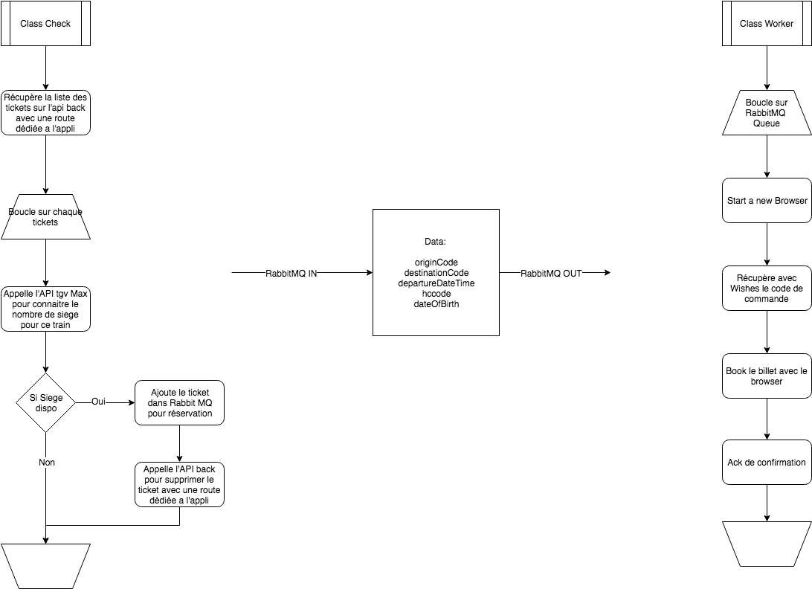

# maxonaute
Booking your tgvmax™ ticket without waiting

## installation

## how to use

## tree

# under the hood

## max-book

Microservice that call back-end api tickets and check for each of them if a seat is available on ticket

there are 2 directories :
  - check : run every minutes the discovery of new seat available on prefered journeys and then send to MQ.
  - book : runs on MQ, wait a new booking order from 'check' and scrap sncf website

  
